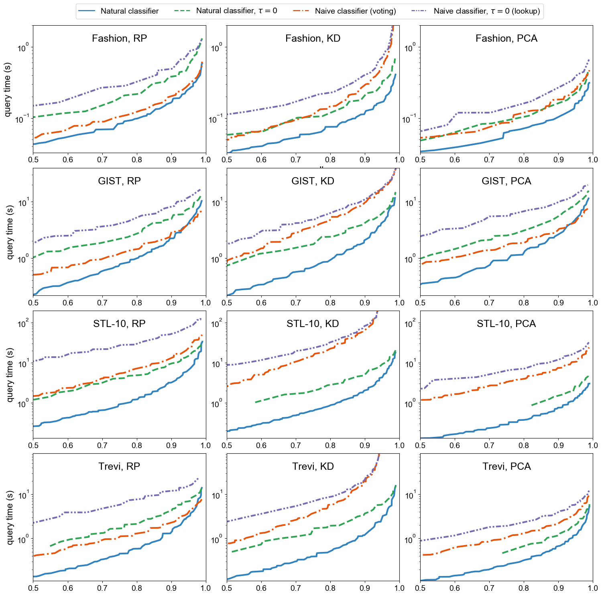
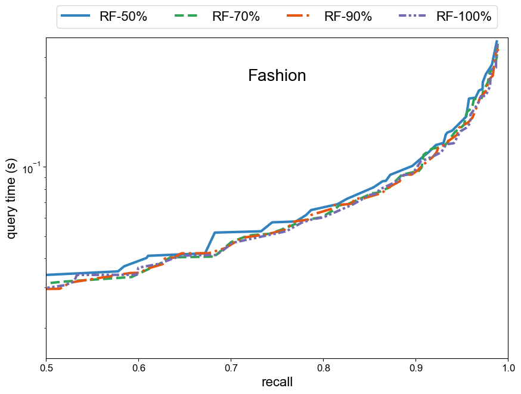

# A Multilabel Framework for Approximate Nearest Neighbor Search


## Requirements

To download the data sets and convert them to the binary format used by the experiment scripts, run:

```setup-data
./get_data.sh
```
Observe that the data sets require 37G disc space (20G if you remove the downloaded files).

Then compute the nearest neighbors (i.e., the labels) for the training, validation, and test sets:
```setup-data
./get_ground_truth.sh
```

To install the dependencies ([FAISS](https://github.com/facebookresearch/faiss) library for HNSW and IVF-PQ, and its requirement [lz4](https://github.com/lz4/lz4)), first add the full path to the root of this repo to the `DIR`-variable in `config.sh`, and then run (requires [CMake](https://cmake.org/download/)):

```setup-algos
./get_algos.sh
```

The linear algebra library [Eigen](https://eigen.tuxfamily.org) and the approximate nearest neighbor search library [ANNOY](https://github.com/spotify/annoy) are bundled.

### Other requirements

We use GCC 5.4.0-2.26 to compile all C++ code; any GCC version supporting C++14 standard and OpenMP should work. We use OpenBLAS 0.2.18 as a low-level linear algebra library.

## Training & Evaluation

To build the index structures and evaluate them on a set of test queries for a `fashion` data set, run:

```train
./comparison.sh fashion
```
The data sets for the main comparisons of the article are
`fashion`, `gist-small`, `trevi`, and `stl10`.


The full grids of hyperparameters for each algorithm and data set are found on the `parameters` folder. The hyperparameters for the baseline algorithms were taken from the leaderboard project [ANN-benchmarks](https://github.com/erikbern/ann-benchmarks).


## Results

### Comparison of the candidate set selection methods

Comparison of the different candidate set selection methods for the unsupervised (`RP`, `KD`, `PCA`) trees:


The performance is measured by average query time for average recall level. Further down is better (faster queries for the given recall level).

The original results used to generate the plots and tables of the  article are saved in `article_results`. The new results are saved to the folder `results`.

To generate the above figure (Figure 2 of the main article) from the new results run:

```plot-trees
python plotting/plot_rf_all-even.py results
```

### Comparison to other types of ANN algorithms

To generate the table (Table 1 of the main article) of the above results at the recall levels 0.8, 0.9, and 0.95 in Latex, run:
```table-all
python plotting/make_table.py results
```
The compared algorithms were [ANNOY](https://github.com/spotify/annoy), [HNSW](https://arxiv.org/abs/1603.09320) and [IVF-PQ](https://hal.inria.fr/inria-00514462/document).


### Results for the noisy labels

To generate Figure 3 of Appendix (for the new results in the `results`-directory), run:
```plot-synthetic
python plotting/plot_ann2.py results
```



## Slurm scripts

The comparison scripts for each data set take from couple of hours to couple of days. This is why we recommend running them on a server. All the experiments require less than 32G memory. You can get (conservative) upper bounds of the running times and memory consumption from `-t` and `--mem`-parameters of the slurm scripts. We ran the experiments on regular nodes with 28 cores, 2 threads and  256 GB RAM. The combined computation time for the experiments was few weeks (on a single CPU node).

We include example scripts to run the experiments on a cluster with the slurm scheduling system. To download the data sets and convert them to to the binary format used by the experiment scripts, run:

```slurm-data
sbatch get_data.job
```

To compute the nearest neighbors for the training, validation, and test sets:
```slurm-data
sbatch get_ground_truth.job
```

To build index structures and evaluate them on a set of test queries on (for instance) a `fashion` data set, run:
```slurm-fashion
sbatch fashion.job
```
